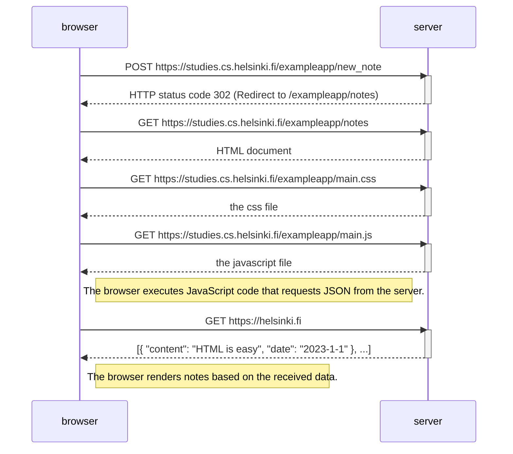

```mermaid

sequenceDiagram
    participant browser
    participant server

    browser->>server: POST https://studies.cs.helsinki.fi/exampleapp/new_note
    activate server
    server-->>browser: HTTP status code 302 (Redirect to /exampleapp/notes)
    deactivate server

    browser->>server: GET https://studies.cs.helsinki.fi/exampleapp/notes
    activate server
    server-->>browser: HTML document
    deactivate server

    browser->>server: GET https://studies.cs.helsinki.fi/exampleapp/main.css
    activate server
    server-->>browser: the css file
    deactivate server

    browser->>server: GET https://studies.cs.helsinki.fi/exampleapp/main.js
    activate server
    server-->>browser: the javascript file
    deactivate server

    Note right of browser: The browser executes JavaScript code that requests JSON from the server.

    browser->>server: GET https://helsinki.fi
    activate server
    server-->>browser: [{ "content": "HTML is easy", "date": "2023-1-1" }, ...]
    deactivate server
    
    Note right of browser: The browser renders notes based on the received data.
```